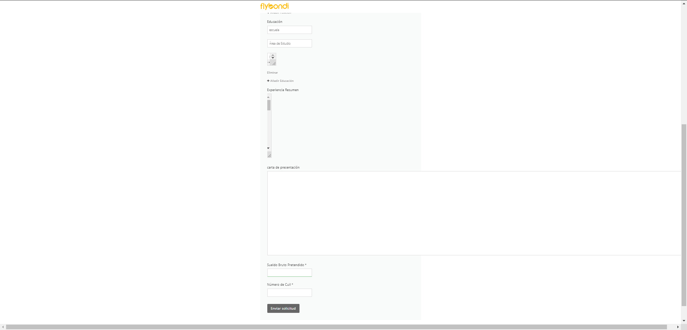

# Fixing-Flybondi's Web ✈️

### PROBLEMA
#### Mientras estaba completando el formulario para postularme a un puesto en la pagina de [Flybondi](https://flybondi.breezy.hr/p/0097a6a84e48/apply?token=2157224a6c21&source=Career%20Portal) emprece a toquetear un poco los text areas y logre hacer esto: 
#### Van a tener que hacer un poco de zoom... 	🔍

### y me tome el atrvimiento de solucionarlo

## SOLUCIONES

Esto se podria solucionar de 2 maneras:
1
- Fijar un max y min, width y height 

--captura--

Con esta solución no solo conseguimos limitar el tamaño maximo sino tambien limitar el minimo, es decir el usuario sigue tenienedo la para modificar el textarea a su gusto pero siempre PERO dentro de unos limites fijados por el desarrollador. Como estamos utilizando medidas relativas 

2
- Otra es hacer uso de la propiedad resize de los textareas.

--captura--

Con esta solución directamente no le permitimos al usuario y por ende evitamos la posibilidad de que pueda romperse el layout