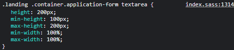

# Fixing-Flybondi's Web ✈️

### PROBLEMA
#### Mientras estaba completando el formulario para postularme a un puesto en la pagina de [Flybondi](https://flybondi.breezy.hr/p/0097a6a84e48/apply?token=2157224a6c21&source=Career%20Portal), me di cuenta de que el redimensionamiento de los textareas no estaba limitado. Toqueteando un poco logre esto: 
#### Van a tener que hacer un poco de zoom... 🔍

#### y me tome el atrvimiento de solucionarlo... 

--------------------

### SOLUCIÓN 1️⃣
#### - Fijar un max y min, width y height: 

#### - Con esta solución no solo conseguimos limitar el tamaño máximo sino también limitar el mínimo, es decir el usuario sigue teniendo libertad para modificar el textarea a su gusto PERO dentro de unos límites fijados por el desarrollador. Como estamos utilizando medidas relativas esta solución no rompe la responsividad de nuestra pagina. 

### SOLUCIÓN 2️⃣
#### - Hacer uso de la propiedad resize de los textareas:

#### - Con esta solución directamente no le permitimos al usuario cambiar las dimensiones del textarea y por ende evitamos la posibilidad de que pueda romperse el layout de nuestra pagina.